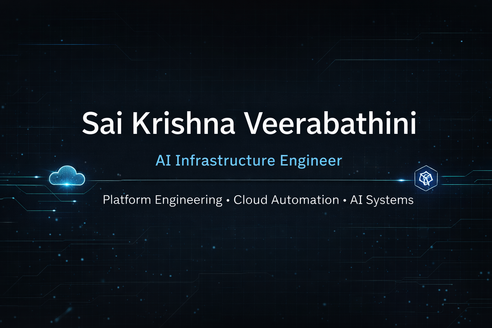

# Sai Krishna Veerabathini

AI Infrastructure Engineer  
Platform Engineering • Cloud Automation • AI for Operations

---

## About Me

I design and build scalable cloud platforms, Kubernetes infrastructure, and automation systems for modern engineering teams.

My work focuses on platform engineering, reusable infrastructure patterns, and operational automation across multi-cloud environments. I am particularly interested in exploring how AI systems can assist infrastructure and operations teams by reducing manual work, improving incident response, and enabling intelligent automation.

---

## Focus Areas

- Platform Engineering  
- Kubernetes Infrastructure  
- Cloud Automation  
- Infrastructure as Code  
- DevOps and CI/CD Systems  
- AI for Infrastructure and Operations  

---

## Featured Work

| Project | Description |
|-------|-------------|
| Reusable EKS Platform Components | Standardized infrastructure modules for provisioning production-ready Kubernetes clusters using reusable infrastructure patterns |
| DevOps-as-a-Service Modules | Infrastructure automation modules designed to accelerate environment provisioning and improve operational consistency |
| AI-Powered DNS Automation | Automation workflows designed to handle infrastructure change requests through intelligent processing and automated execution |
| FinOps Waste Detection Agent | AI-assisted system designed to detect idle cloud resources and support cloud cost optimization |

---

## AI Infrastructure Lab

I actively explore how **AI systems can augment infrastructure and operations workflows**.  
This lab is where I experiment with **agentic automation, infrastructure copilots, and intelligent operational tooling.**

### Current Experiments

| Project | Description |
|-------|-------------|
| Incident Triage Agent | AI assistant that analyzes alerts, logs, and incidents to suggest remediation steps |
| Infrastructure Knowledge Assistant | RAG-based system for querying infrastructure documentation and operational runbooks |
| Kubernetes Troubleshooting Copilot | AI system that assists engineers in diagnosing Kubernetes issues |
| Cloud Waste Detection Agent | AI-powered analysis of cloud usage to identify idle resources and cost optimization opportunities |
| AI DNS Automation | Intelligent workflow automation for handling DNS change requests |

---

### Technologies Used

---

## Technologies

### Cloud Platforms
AWS • Azure • GCP

### Containers and Orchestration
Kubernetes • Docker • Helm

### Infrastructure as Code
Pulumi • Terraform • CloudFormation

### CI/CD and Automation
GitHub Actions • Jenkins • Tekton

### AI Systems
Large Language Models • Retrieval Augmented Generation • Agentic Workflows

---

## Tech Stack

### Cloud Platforms

---

### Containers & Orchestration

---

### Infrastructure as Code

---

### CI/CD

---

### Observability

---

### Automation

---

### Networking

---

### AI for Operations

---

### Operating Systems

---
## Infrastructure Philosophy

I approach infrastructure and platform engineering as a systems design problem rather than a tooling problem.

My focus is on building platforms that reduce operational friction, improve reliability, and enable engineering teams to move faster with confidence.

Core principles I follow:

• **Infrastructure as a Product**  
Platforms should be designed with clear interfaces, reusable components, and strong developer experience.

• **Automation Over Manual Operations**  
Operational toil should be eliminated through automation, intelligent workflows, and self-service platforms.

• **Observability by Design**  
Systems must provide clear signals through metrics, logs, and traces to enable rapid diagnosis and continuous improvement.

• **Scalable Platform Patterns**  
Reusable infrastructure modules and standardized architectures allow teams to build faster while maintaining consistency.

• **AI-Augmented Operations**  
AI systems and agentic workflows will increasingly assist engineers in incident analysis, operational troubleshooting, and infrastructure management.

---

## GitHub Activity

---

## Connect

Portfolio  
https://saikrishna.veerabathini.ai  

LinkedIn  
https://www.linkedin.com/in/sai-krishna-veerabathini-b0393340  

GitHub  
https://github.com/sveerabathini
